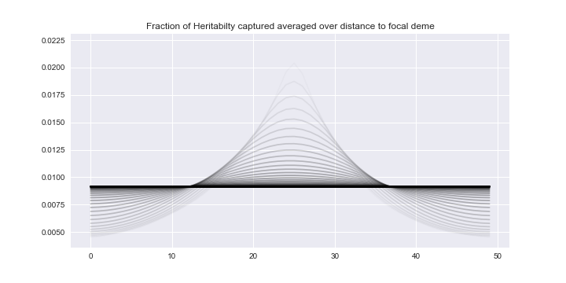

# Calculating missing heritability

This directory holds preliminary results.

A `NumPy` byte array containing float values for the fraction of missing heritability captured by sampling from the spatial simulation with selection.

The array is called `H_var_centered_pop_size_100000.0_mu_0_s_0.001_m_0.1_label_021820.npy`. It can be read into memory with `np.load()`.

The array has dimensions *(50,50,1)*.
Axes 1 and 2 represent spatial coordinates (*1 dimensional spatial environment*  with length **L = 50**).
Axis 0 contains subarrays representing fractional heritability **H** values as a function of .

 ranges from *(0, L)* by steps of 1.

The values in each subarray can be computed as follows:

%20%3D%20%5Cfrac%7B%5Csum_%7Bk%3D1%7D%5E%7Bnumreps%7D%20f_k(1-f_k)%20%5Cbf%7BP%7D%7D%7B%5Csum_%7Bk%3D1%7D%5E%7Bnumreps%7D%20f_k(1-f_k)%7D%20%24)

**P** is a matrix which contains the probability of sampling the allele at each deme, *numreps* represents the number of independent replicate simulations performed for each set of population parameters,  is the standard deviation of the gaussian sampling kernel, and  is the allele frequency at a focal deme selected to be some distance from the center of the sampling kernel. This distance is represented in the elements of axis 1 of the array. As we move further away from the center of the distribution, we are increasing the distance between the focal deme and the center of the sampling kernel. **
decreases as distance from the sampling center increases.**

The following parameter values were used to generate the simulation sampled from:
  * Selection coefficient 

  * Migration rate 

  * Population size 

  * Sample size 

The simulation uses reflecting boundaries for frequency trajectories. Once the focal allele goes extinct in the spatial environment, a new allele is introduced at a frequency of 
. This removes the need to explicitly provide a mutation rate.

The [figure](/H_plot_s_0.0001_m_0.1_pop_size_1e-5.png) included in this directory was made by plotting **H** on the *y-axis* over the range of . The *x-axis* is distance from the focal deme to the center of the sampling kernel.  increases from *0* at the lightest color curve, to *L* at the darkest curve.

